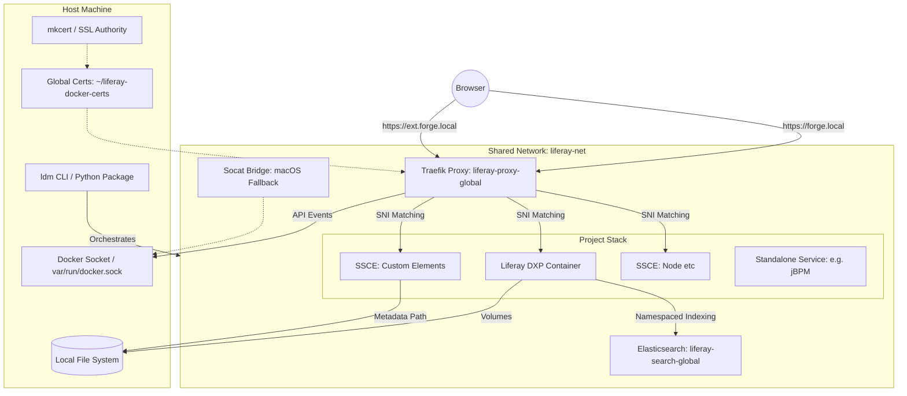
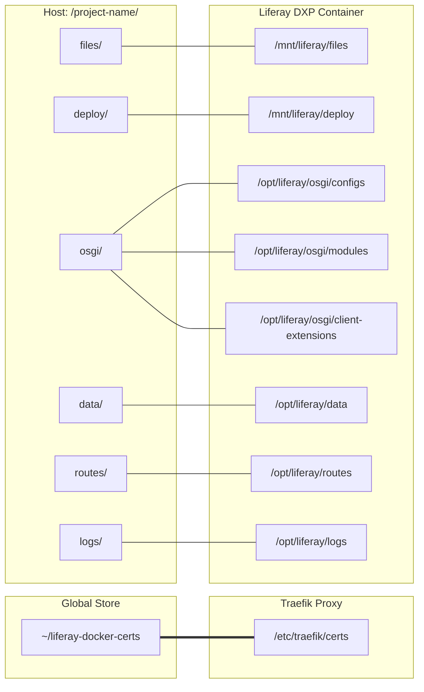
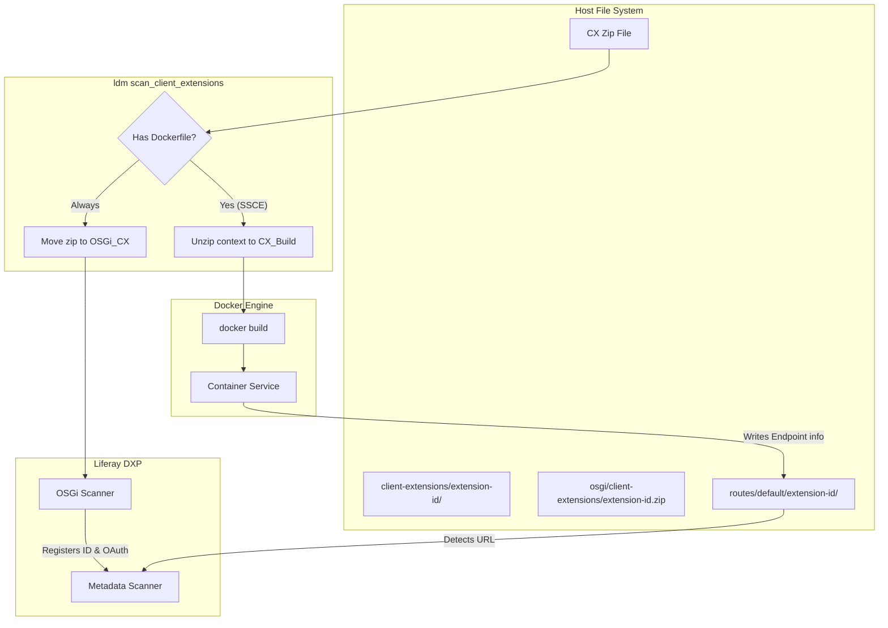
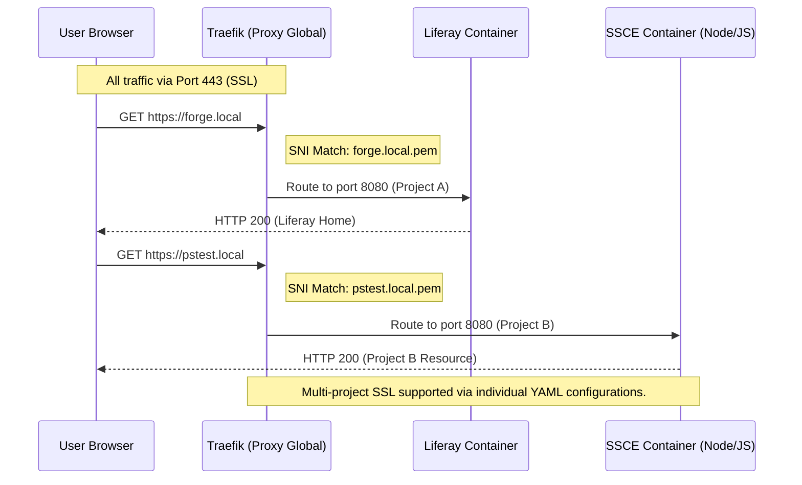
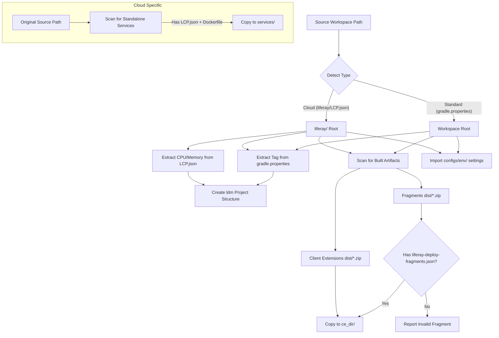

# Liferay Docker Manager (LDM) Architecture

This document contains visual diagrams of the LDM environment, volume structure, and routing logic. Use a Mermaid-compatible viewer (like VS Code's Markdown Preview) to see the graphics.

## 1. Environment Architecture

This diagram illustrates how the `ldm` tool orchestrates the main Liferay instance, the shared infrastructure, and the client extensions.



---

## 2. Volume Mounting Structure

This diagram shows how `ldm` maps your local project folder and the global certificate store into the containers.



---

## 3. Client Extension Deployment Lifecycle

This diagram illustrates the dual path `ldm` takes when it finds a Client Extension zip: building the Docker service and providing the OSGi configuration to Liferay.



---

## 4. Subdomain Routing Logic

This diagram illustrates how a single Traefik instance uses **SNI (Server Name Indication)** and Docker labels to route encrypted traffic to the correct service.



### 5. Metadata & Property Injection

To ensure maximum reliability across all Liferay versions, LDM injects critical infrastructure settings directly into the project's `portal-ext.properties` file before startup. This bypasses the unreliable environment variable decoding found in newer DXP versions.

| Category | Properties Managed |
| :--- | :--- |
| **SSL / Routing** | `web.server.protocol`, `web.server.host`, `virtual.hosts.valid.hosts` |
| **Search (ES8)** | `elasticsearch.sidecar.enabled=false`, `elasticsearch.connection.url`, `elasticsearch.index.name.prefix` |
| **Clustering** | `cluster.link.enabled`, `lucene.replicate.write` (Active when scaled > 1) |
| **Identity** | `liferay.docker.image`, `liferay.docker.tag` |

### 6. Multi-Node Scaling & Clustering

When a service is scaled via `ldm scale [project] liferay=N`:

1. **Load Balancing**: Traefik automatically detects the multiple containers and performs round-robin load balancing across all healthy nodes.
2. **Clustering Injection**: LDM automatically injects `LIFERAY_CLUSTER__LINK__ENABLED=true` and `LIFERAY_LUCENE__REPLICATE__WRITE=true` to ensure the nodes synchronize their state.
3. **State Isolation**: For scaled Liferay instances, the host-mapped `osgi/state` and `logs` directories are disabled to prevent file-locking conflicts between nodes (each node keeps its state and logs within its own container ephemeral layer).

```text
```

### 5. Workspace Import Engine

This diagram shows how `ldm import` transforms a Liferay Workspace (Standard or Cloud) into an `ldm` project.



### Key Architectural Pillars

1. **Modular Orchestration (ldm_core Package):**
    * The tool logic is split into specialized handler mixins (`Stack`, `Workspace`, `Config`, `Snapshot`, `Diagnostics`, `License`), ensuring a maintainable and extensible codebase.
    * Every command supports a standardized discovery priority: **Argument > Flag > CWD > Interactive Selection**.
    * **Mandatory Compose v2**: LDM strictly requires the **Docker Compose v2 Plugin** (`docker compose`). Legacy v1 standalone binaries are no longer supported due to modern library and API incompatibilities.

2. **Proactive Security & Compliance (LicenseHandler):**
    * **Automatic License Discovery**: Scans `common/`, `deploy/`, and `osgi/modules/` for Liferay XML licenses.
    * **XML Parsing & Validation**: Extracts product name, owner, and expiration dates using a secure, local-only XML parser.
    * **Fail-Fast Enforcement**: Prevents or warns about DXP/EE orchestration when a valid license is missing, while remaining silent for Portal CE projects.

3. **Shared Infrastructure (Global Tier):**
    * **Traefik (`liferay-proxy-global`)**: A singleton container that handles all SSL termination and namespaced routing. It works natively on **Linux, WSL2, and Colima** by detecting the standard Docker socket. **Traefik v3** requires explicit backend network labels (`traefik.docker.network=liferay-net`) which LDM manages automatically.
    * **Elasticsearch (`liferay-search-global`)**: A shared ES8 instance that uses project-specific index prefixes, allowing multiple projects to share one search cluster efficiently.
        * **Self-Healing Setup**: LDM automatically installs required Liferay plugins (`analysis-icu`, `analysis-kuromoji`, `analysis-smartcn`, `analysis-stempel`) upon initialization.
        * **Performance Tuning**: Automatically configures `indices.query.bool.max_clause_count=10000` for optimal Liferay compatibility.

    * **Sidecar Fallback**: If the global container is missing, LDM automatically suppresses global ES configs to allow Liferay's internal **Sidecar** to start without configuration conflicts.
    * **Socat Bridge (Fallback)**: An optional bridge used only on macOS when the standard `/var/run/docker.sock` is missing (primarily for Docker Desktop isolation).

4. **Multi-Instance Isolation (Project Tier):**
    * **Network Stability**: All services use unique namespacing for Traefik routers and services (e.g., `[project-id]-main`), preventing routing collisions.
    * **Session Security**: Unique session cookie names are generated based on the project's virtual hostname to prevent session cross-talk.
    * **Standalone Services**: Arbitrary containers (like jBPM) placed in the `services/` folder are seamlessly orchestrated with the same routing and resource guardrails as Liferay.

5. **Persistence & State Management:**
    * **Orchestrated Snapshots**: Project snapshots include the database, Document Library, and the **Elasticsearch 8.x index state**, ensuring consistent recovery.
    * **Automated Healthchecks**: Converts `LCP.json` probes into native Docker healthchecks for robust orchestration.
    * **SSL**: `mkcert` provides automated, locally trusted wildcard certificates for all project subdomains.

6. **Resource Identification & Metadata:**
    * To ensure reliable global maintenance and pruning, LDM injects specialized Docker labels into every container it creates:

```text
| Label | Purpose | Example |
| :--- | :--- | :--- |
| `com.liferay.ldm.managed` | Flags the container as LDM-controlled. | `true` |
| `com.liferay.ldm.project` | Identifies which LDM project the container belongs to. | `my-project` |

The ldm prune command uses these labels to cross-reference active containers against the projects present on the filesystem, allowing it to safely identify and remove orphans from deleted projects.
```
