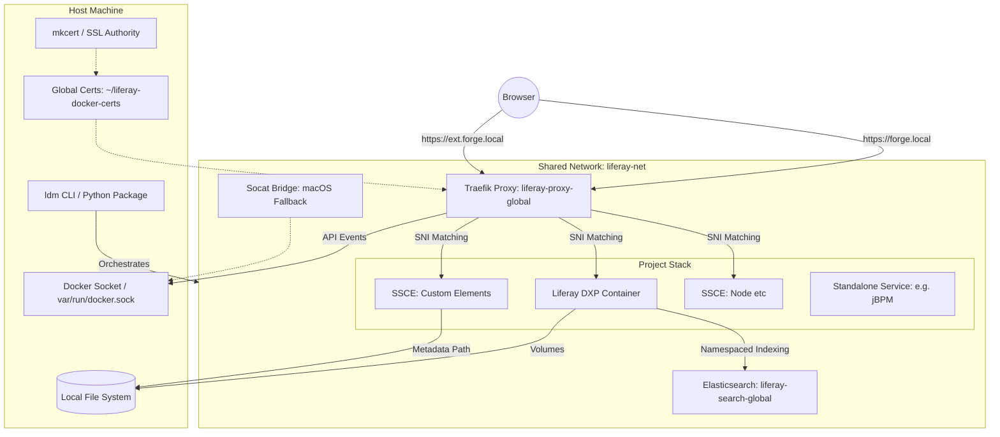
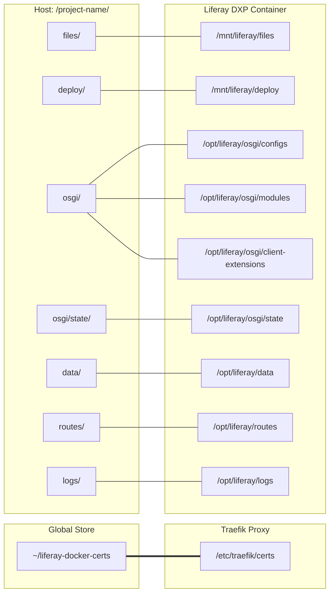
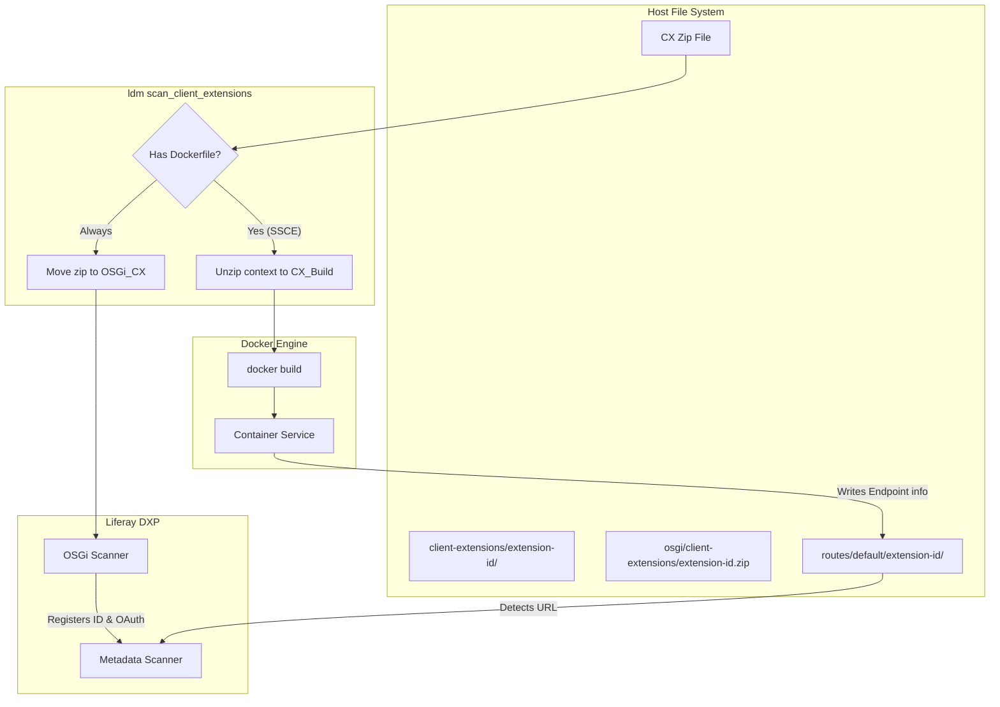
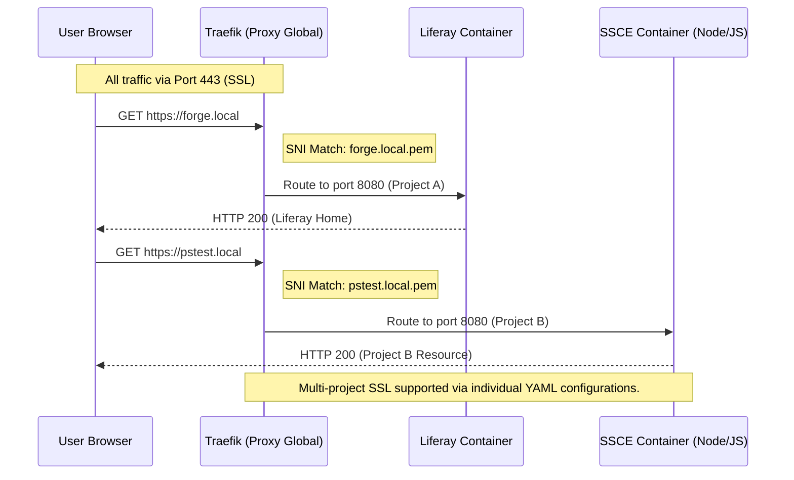

# Liferay Docker Manager (LDM) Architecture

This document contains visual diagrams of the LDM environment, volume structure, and routing logic. Use a Mermaid-compatible viewer (like VS Code's Markdown Preview) to see the graphics.

## 1. Environment Architecture

This diagram illustrates how the `ldm` tool orchestrates the main Liferay instance, the shared infrastructure, and the client extensions.

---

## 2. Volume Mounting Structure

This diagram shows how `ldm` maps your local project folder and the global certificate store into the containers.

---

## 3. Client Extension Deployment Lifecycle

This diagram illustrates the dual path `ldm` takes when it finds a Client Extension zip: building the Docker service and providing the OSGi configuration to Liferay.

---

## 4. Subdomain Routing Logic

This diagram illustrates how a single Traefik instance uses **SNI (Server Name Indication)** and Docker labels to route encrypted traffic to the correct service.

### 5. Metadata & Property Injection

To ensure maximum reliability and to follow how Liferay expects infrastructure to be configured, LDM uses a tiered configuration strategy.

- **Redline 1 (Database)**: JDBC and Hibernate settings MUST live in `portal-ext.properties` to ensure mixed-case property keys are correctly parsed.
- **Redline 2 (Search/Infra)**: Search, SSL, and Clustering MUST live in high-priority **Environment Variables** or **OSGi `.config`** files to ensure isolation and skip Sidecar startup.

| Category | Properties Managed / Standardized |
| :--- | :--- |
| **Database (MySQL/MariaDB)** | **Managed via `portal-ext.properties`**. Standardized on MariaDB JDBC Driver (`org.mariadb.jdbc.Driver`) and `MariaDB103Dialect` for all 2025+ and 2026.Q1 LTS builds. Includes performance connection URL optimizations. |
| **Database (PostgreSQL)** | **Managed via `portal-ext.properties`**. Standardized on `org.postgresql.Driver` and `PostgreSQL10Dialect`. |
| **Conflict Avoidance** | If custom `LIFERAY_JDBC_PERIOD_` environment variables are detected in metadata, LDM **skips** writing JDBC properties to `portal-ext.properties` to ensure the user's manual config takes precedence. |
| **SSL / Routing** | **Managed via Environment Variables**. Enforces `web.server.*` and `redirect.url.*` settings for proxy alignment. |
| **Search (ES8)** | **Managed via Environment Variables & OSGi .config Substitution.** LDM enforces `LIFERAY_ELASTICSEARCH_SIDECAR_ENABLED=false` and unique `indexNamePrefix` dynamically to prevent collisions and skip Sidecar startup. |
| **Clustering** | **Managed via Environment Variables**. Automatically injects `cluster.link.enabled` and `lucene.replicate.write` when scaled > 1. |
| **Identity** | `liferay.docker.image`, `liferay.docker.tag` (Labels & Env) |

### 6. Persistence & State Management

LDM handles project state surgically to ensure snapshots are portable and complete.

- **Offline-First Design (Mandate)**: LDM is designed to be functional without an active internet connection. It uses a tiered asset discovery strategy:
  1. **Local Cache**: Always checks `~/.ldm/references` first for seeds, samples, or configuration templates.
  2. **Atomic Download**: If an asset is missing and a connection is available, LDM performs an atomic download and caches it for future use.
  3. **Graceful Fallback**: If the asset is missing and unreachable, LDM flags the offline state and reverts to the standard "Vanilla" (non-seeded) workflow.
  4. **Samples Exception**: The `--samples` workflow requires assets to be present. If missing and unreachable, LDM informs the user and stops gracefully to avoid broken environments.

- **Integrity Verification**: As of v2.4.0, all snapshots and pre-warmed seeds include **SHA-256 checksums**. LDM automatically verifies these checksums during `restore` and `import` to ensure data integrity and detect corruption.
- **Proactive Volume Write Test**: As of v2.4.26, LDM performs a real-world write test during `ldm doctor`. It spins up a temporary container to attempt a `touch` operation as UID 1000 (the Liferay user), proactively identifying read-only volume mounts caused by Docker Desktop integration or Colima permission mismatches.
- **Orchestrated Snapshots**: Project snapshots include the database, Document Library, and the **Elasticsearch 8.x index state**.
- **Pre-warmed Bootstrap Seeds**: To eliminate the ~15 minute initialization time for new projects, LDM automatically fetches pre-initialized "Seed" volumes (Database + Search Index + **OSGi State**) from a dedicated GitHub repository. These seeds are version-matched to the requested Liferay tag.
- **Environment Capture**: During `ldm snapshot`, the tool automatically parses the project's `docker-compose.yml` to capture custom `LIFERAY_` environment variables. These are stored in the snapshot metadata and restored during `ldm restore`, ensuring that manual tweaks are never lost during rollback.
- **Automated Healthchecks**: Converts `LCP.json` probes into native Docker healthchecks for robust orchestration.
- **SSL**: `mkcert` provides automated, locally trusted wildcard certificates for all project subdomains.

### 7. Multi-Node Scaling & Clustering

When a service is scaled via `ldm scale [project] liferay=N`:

1. **Load Balancing**: Traefik automatically detects the multiple containers and performs round-robin load balancing across all healthy nodes.
2. **Clustering Injection**: LDM automatically injects `LIFERAY_CLUSTER__LINK__ENABLED=true` and `LIFERAY_LUCENE__REPLICATE__WRITE=true` to ensure the nodes synchronize their state.
3. **State Isolation**: For scaled Liferay instances, the host-mapped `osgi/state` and `logs` directories are disabled to prevent file-locking conflicts between nodes (each node keeps its state and logs within its own container ephemeral layer).

---

### Key Architectural Pillars

1. **Modular Orchestration (ldm_core Package):**
    - The tool logic is decomposed into focused, specialized handlers (`ComposerHandler`, `RuntimeHandler`, `AssetHandler`, `WorkspaceHandler`, `SnapshotHandler`, `ConfigHandler`, `DiagnosticsHandler`, `CloudHandler`, `LicenseHandler`, `InfraHandler`), ensuring a maintainable and extensible codebase.
    - **Stack Composition (`ComposerHandler`)**: Pure logic for generating the `docker-compose.yml` and translating metadata into infrastructure. Enforces resource limits (e.g., adding `M` suffix to memory limits for Docker compatibility).
    - **Container Lifecycle (`RuntimeHandler`)**: Manages the synchronization, health, and state of the container stack.
    - **Offline-First Engine (`AssetHandler`)**: Orchestrates the discovery, caching, and hydration of seeds and samples.
    - **Proactive Health (`DiagnosticsHandler`)**: Performs over 20 environmental health checks, including proactive volume write testing and context-aware provider detection (identifying Docker Desktop vs. Native engine).
    - **Project Registry**: Centralizes project and hostname collision detection to prevent infrastructure conflicts across the filesystem.
    - Every command supports a standardized discovery priority: **Argument > Flag > CWD > Interactive Selection**.
    - **Resilient Tag Discovery**: The discovery engine uses a dual-mode parser supporting both the Docker Hub API (JSON) and the Liferay Release Server (HTML), ensuring the tool remains functional even when primary upstream APIs change.
    - **Mandatory Compose v2**: LDM strictly requires the **Docker Compose v2 Plugin** (`docker compose`). Legacy v1 standalone binaries are no longer supported due to modern library and API incompatibilities.

2. **Proactive Security & Compliance (LicenseHandler):**
    - **Automatic License Discovery**: Scans `common/`, `deploy/`, and `osgi/modules/` for Liferay XML licenses.
    - **XML Parsing & Validation**: Extracts product name, owner, and expiration dates using a secure, local-only XML parser.
    - **Fail-Fast Enforcement**: Prevents or warns about DXP/EE orchestration when a valid license is missing, while remaining silent for Portal CE projects.

3. **Shared Infrastructure (Global Tier):**
    - **Traefik (`liferay-proxy-global`)**: A singleton container that handles all SSL termination and namespaced routing. It works natively on **Linux, WSL2, and Colima** by detecting the standard Docker socket. **Traefik v3** requires explicit backend network labels (`traefik.docker.network=liferay-net`) which LDM manages automatically.
    - **Elasticsearch (`liferay-search-global`)**: A shared ES8 instance that uses project-specific index prefixes, allowing multiple projects to share one search cluster efficiently.
        - **Self-Healing Setup**: LDM automatically installs required Liferay plugins (`analysis-icu`, `analysis-kuromoji`, `analysis-smartcn`, `analysis-stempel`) upon initialization.
        - **Performance Tuning**: Automatically configures `indices.query.bool.max_clause_count=10000` for optimal Liferay compatibility.

    - **Context-Aware Provider Detection**: LDM automatically identifies the active Docker engine context (e.g., `docker-desktop` vs. `default`) on Windows/macOS to provide tailored troubleshooting hints and optimize volume mount paths.
    - **Sidecar Fallback**: If the global container is missing, LDM automatically suppresses global ES configs to allow Liferay's internal **Sidecar** to start without configuration conflicts.
    - **Socat Bridge (Fallback)**: An optional bridge used only on macOS when the standard `/var/run/docker.sock` is missing (primarily for Docker Desktop isolation).

4. **Multi-Instance Isolation (Project Tier):**
    - **Network Stability**: All services use unique namespacing for Traefik routers and services (e.g., `[project-id]-main`), preventing routing collisions.
    - **Session Security**: Unique session cookie names are generated based on the project's virtual hostname to prevent session cross-talk.
    - **Standalone Services**: Arbitrary containers (like jBPM) placed in the `services/` folder are seamlessly orchestrated with the same routing and resource guardrails as Liferay.
