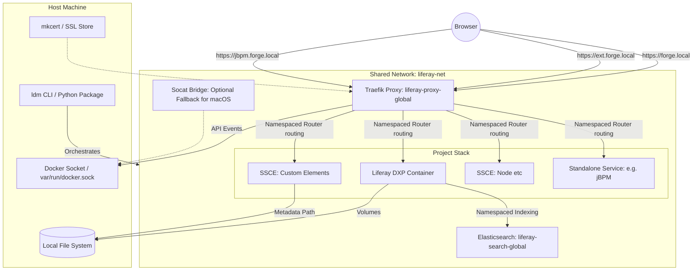
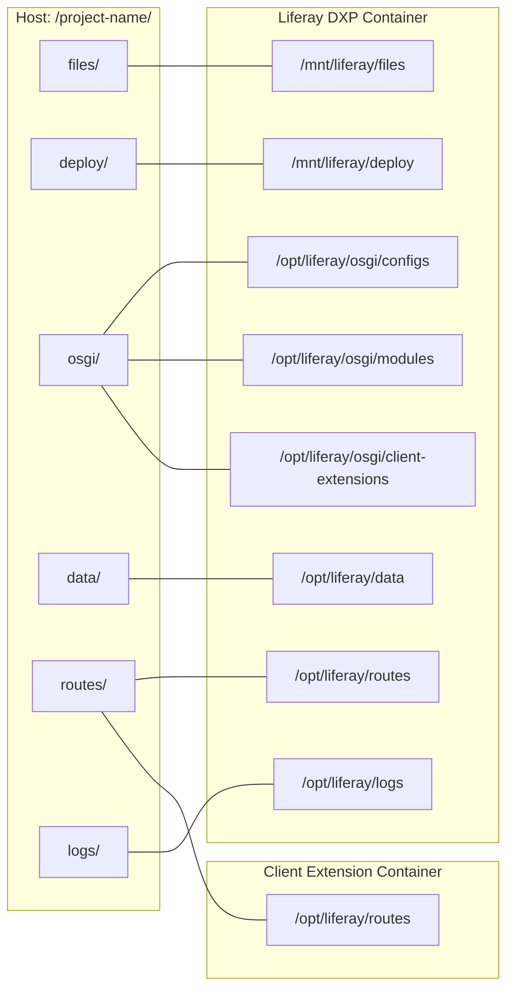
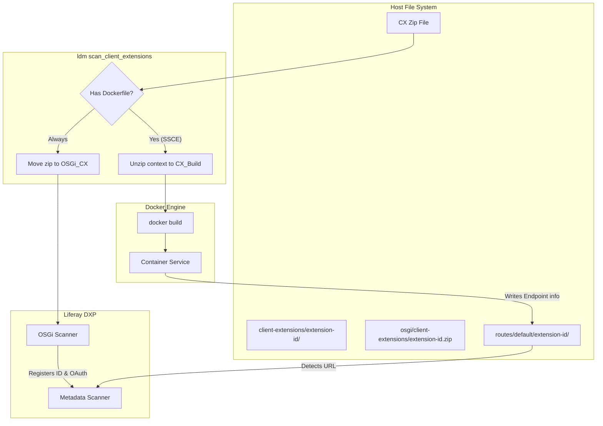
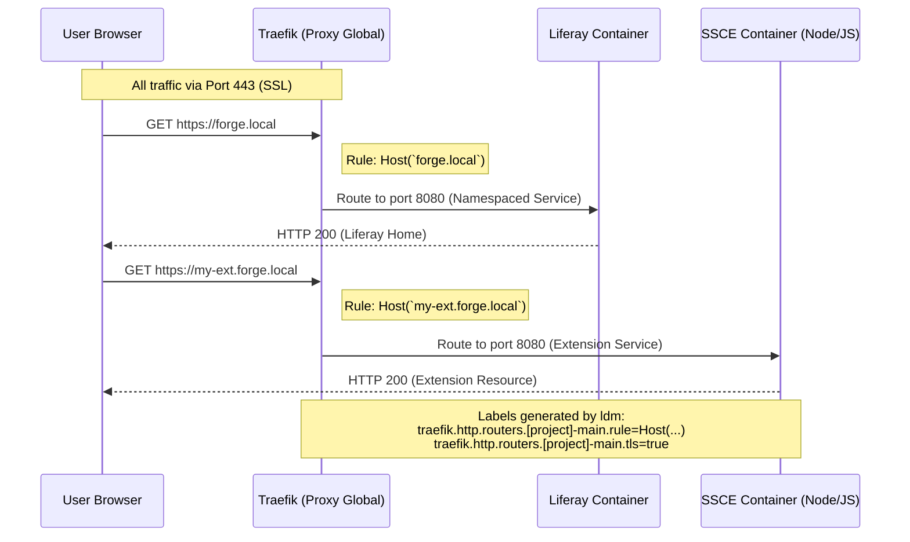
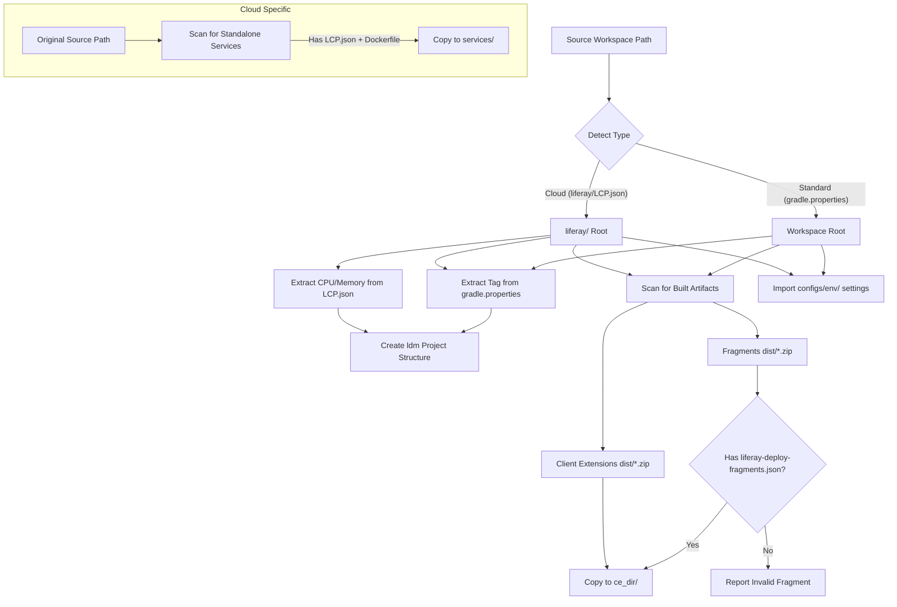

# Liferay Docker Manager (LDM) Architecture

This document contains visual diagrams of the LDM environment, volume structure, and routing logic. Use a Mermaid-compatible viewer (like VS Code's Markdown Preview) to see the graphics.

## 1. Environment Architecture

This diagram illustrates how the `ldm` tool orchestrates the main Liferay instance, the shared infrastructure, and the client extensions.

---

## 2. Volume Mounting Structure

This diagram shows how `ldm` maps your local project folder into the containers to allow for hot-reloading and data persistence.

---

## 3. Client Extension Deployment Lifecycle

This diagram illustrates the dual path `ldm` takes when it finds a Client Extension zip: building the Docker service and providing the OSGi configuration to Liferay.

---

## 4. Subdomain Routing Logic

This diagram illustrates how a single Traefik instance uses the `Host` header and Docker labels to route encrypted traffic to the correct service.

## 5. Workspace Import Engine

This diagram shows how `ldm import` transforms a Liferay Workspace (Standard or Cloud) into an `ldm` project.

### Key Architectural Pillars

1. **Modular Orchestration (ldm_core Package):**
    * The tool logic is split into specialized handler mixins (`Stack`, `Workspace`, `Config`, `Snapshot`, `Diagnostics`), ensuring a maintainable and extensible codebase.
    * Every command supports a standardized discovery priority: **Argument > Flag > CWD > Interactive Selection**.

2. **Shared Infrastructure (Global Tier):**
    * **Traefik (`liferay-proxy-global`)**: A singleton container that handles all SSL termination and namespaced routing. It works natively on **Linux, WSL2, and Colima** by detecting the standard Docker socket.
    * **Elasticsearch (`liferay-search-global`)**: A shared ES8 instance that uses project-specific index prefixes, allowing multiple projects to share one search cluster efficiently.
    * **Socat Bridge (Fallback)**: An optional bridge used only on macOS when the standard `/var/run/docker.sock` is missing (primarily for Docker Desktop isolation).

3. **Multi-Instance Isolation (Project Tier):**
    * **Network Stability**: All services use unique namespacing for Traefik routers and services (e.g., `[project-id]-main`), preventing routing collisions.
    * **Session Security**: Unique session cookie names are generated based on the project's virtual hostname to prevent session cross-talk.
    * **Standalone Services**: Arbitrary containers (like jBPM) placed in the `services/` folder are seamlessly orchestrated with the same routing and resource guardrails as Liferay.

4. **Persistence & State Management:**
    * **Orchestrated Snapshots**: Project snapshots include the database, Document Library, and the **Elasticsearch 8.x index state**, ensuring consistent recovery.
    * **Automated Healthchecks**: Converts `LCP.json` probes into native Docker healthchecks for robust orchestration.
    * **SSL**: `mkcert` provides automated, locally trusted wildcard certificates for all project subdomains.

### 5. Resource Identification & Metadata

To ensure reliable global maintenance and pruning, LDM injects specialized Docker labels into every container it creates:

| Label | Purpose | Example |
| :--- | :--- | :--- |
| `com.liferay.ldm.managed` | Flags the container as LDM-controlled. | `true` |
| `com.liferay.ldm.project` | Identifies which LDM project the container belongs to. | `my-project` |

The `ldm prune` command uses these labels to cross-reference active containers against the projects present on the filesystem, allowing it to safely identify and remove orphans from deleted projects.
