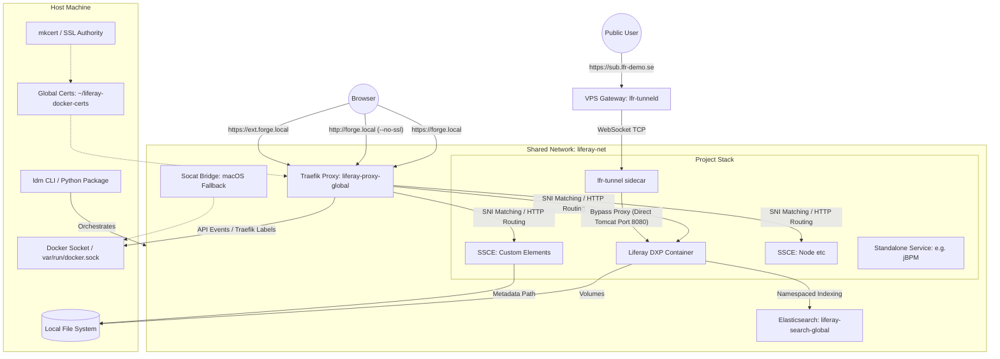
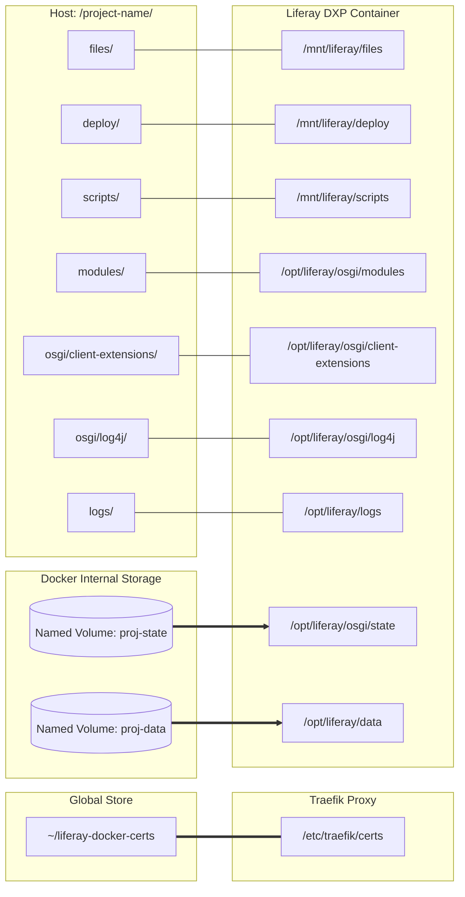
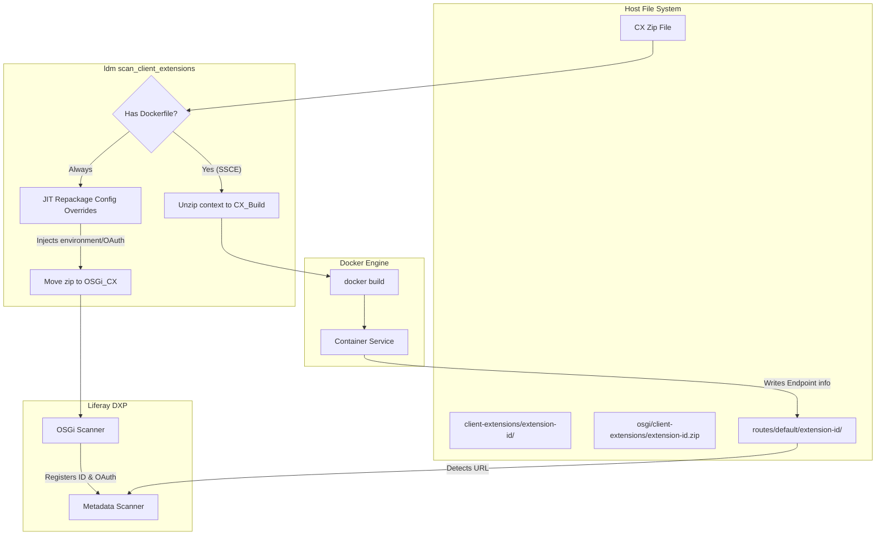
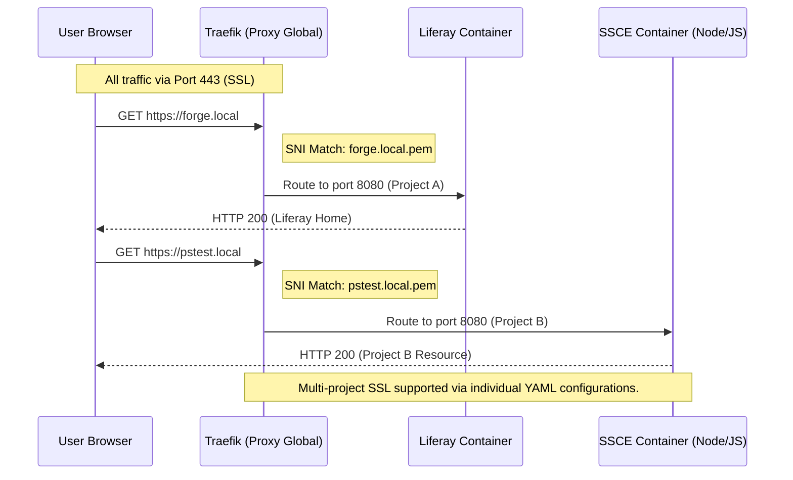
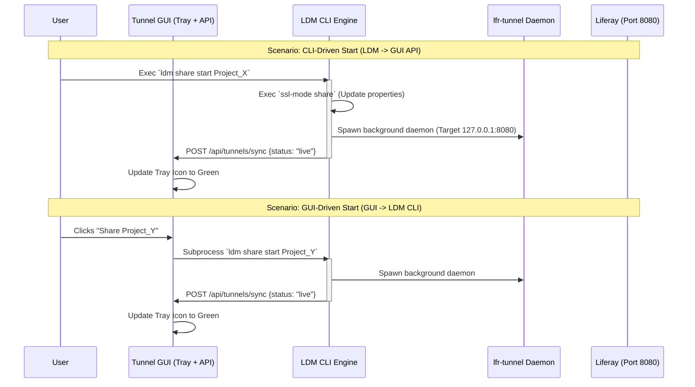

# Liferay Docker Manager (LDM) Architecture

This document contains visual diagrams of the LDM environment, volume structure, and routing logic. Use a Mermaid-compatible viewer (like VS Code's Markdown Preview) to see the graphics.

## 1. Environment Architecture

This diagram illustrates how the `ldm` tool orchestrates the main Liferay instance, the shared infrastructure, and the client extensions.

---

## 2. Volume Mounting Structure (Hybrid Strategy)

To ensure maximum reliability across different host filesystems (especially **macOS** and **ExFAT** external drives), LDM employs a **Hybrid Mount Strategy**.

- **Named Volumes**: Used for directories that require strict POSIX file locking (`fcntl`/`flock`). These are stored within the Linux VM's native filesystem.
- **Host Bind-Mounts**: Used for directories that facilitate hot-swapping code, configurations, and deployment artifacts from the host IDE.

---

## 3. Client Extension Deployment Lifecycle

This diagram illustrates the dual path `ldm` takes when it finds a Client Extension zip: building the Docker service and providing the OSGi configuration to Liferay.

---

## 4. Subdomain Routing Logic

This diagram illustrates how a single Traefik instance uses **SNI (Server Name Indication)** and Docker labels to route encrypted traffic to the correct service.

### 5. Metadata & Property Injection

To ensure maximum reliability and to follow how Liferay expects infrastructure to be configured, LDM uses a tiered configuration strategy.

- **Redline 1 (Database)**: JDBC and Hibernate settings MUST live in `portal-ext.properties` to ensure mixed-case property keys are correctly parsed.
- **Redline 2 (Search/Infra)**: Search, SSL, and Clustering MUST live in high-priority **Environment Variables** or **OSGi `.config`** files to ensure isolation and skip Sidecar startup.

| Category | Properties Managed / Standardized |
| :--- | :--- |
| **Database (MySQL/MariaDB)** | **Managed via `portal-ext.properties`**. Standardized on MariaDB JDBC Driver (`org.mariadb.jdbc.Driver`) and `MariaDB103Dialect` for all 2025+ and 2026.Q1 LTS builds. Includes performance connection URL optimizations. |
| **Database (PostgreSQL)** | **Managed via `portal-ext.properties`**. Standardized on `org.postgresql.Driver` and `PostgreSQL10Dialect`. |
| **Conflict Avoidance** | If custom `LIFERAY_JDBC_PERIOD_` environment variables are detected in metadata, LDM **skips** writing JDBC properties to `portal-ext.properties` to ensure the user's manual config takes precedence. |
| **SSL / Routing** | **Managed via Environment Variables**. Enforces `web.server.*` and `redirect.url.*` settings for proxy alignment. |
| **Search (ES8)** | **Shared Infrastructure / Interactive Resolution.** LDM attempts to use Global Search by enforcing `LIFERAY_ELASTICSEARCH_SIDECAR_ENABLED=false` dynamically. If custom Elasticsearch `.config` files are detected, LDM pauses execution and interactively prompts the user to either preserve their remote configuration, migrate to Global Search, or delete the configs to force local Sidecar. |
| **Clustering** | **Managed via Environment Variables**. Automatically injects `cluster.link.enabled` and `lucene.replicate.write` when scaled > 1. |
| **Identity** | `liferay.docker.image`, `liferay.docker.tag` (Labels & Env) |

### 6. Persistence & State Management

LDM handles project state surgically to ensure snapshots are portable and complete.

- **Offline-First Design (Mandate)**: LDM is designed to be functional without an active internet connection. It uses a tiered asset discovery strategy:
  1. **Local Cache**: Always checks `~/.ldm/references` first for seeds, samples, or configuration templates.
  2. **Atomic Download**: If an asset is missing and a connection is available, LDM performs an atomic download and caches it for future use.
  3. **Graceful Fallback**: If the asset is missing and unreachable, LDM flags the offline state and reverts to the standard "Vanilla" (non-seeded) workflow.
  4. **Samples Exception**: The `--samples` workflow requires assets to be present. If missing and unreachable, LDM informs the user and stops gracefully to avoid broken environments.

- **Zero-Race Atomic Deployment Strategy**: As of v2.7.6, LDM employs a **Staging, Fixup & Atomic Move** pattern for all file synchronizations targeting Liferay's watched directories (`deploy/`, `osgi/modules/`, `osgi/configs/`, `osgi/client-extensions/`).
  1. **Staging**: Files are first written to a hidden `.tmp` file (e.g., `.my-artifact.zip.tmp`) in the destination folder.
  2. **Invisibility**: Liferay's `AutoDeployScanner` ignores hidden files starting with a dot, ensuring it never attempts to process a partial or incorrectly-permissioned artifact.
  3. **Permission Fixup**: While still hidden, LDM performs a **Unix Permission Fixup**:
     - **Broaden Access**: Applies `chmod 666` to ensure the file is readable/writable by any container user.
     - **Ownership Handover**: If LDM is running as root (common in CI or with sudo), it proactively executes `chown 1000:1000` to hand ownership to the `liferay` user.
  4. **Atomic Move**: Once the file has the correct permissions and ownership, LDM performs an atomic `os.replace` (rename) to the final destination.
  This ensures that when the artifact "appears" to Liferay's scanner, it is already perfectly permissioned and complete, eliminating `java.util.zip.ZipException` and "Permission Denied" race conditions.
- **Integrity Verification**: As of v2.4.0, all snapshots and pre-warmed seeds include **SHA-256 checksums**. LDM automatically verifies these checksums during `restore` and `import` to ensure data integrity and detect corruption.
- **Proactive Volume Write Test**: As of v2.4.26, LDM performs a real-world write test during `ldm doctor`. It spins up a temporary container to attempt a `touch` operation as UID 1000 (the Liferay user), proactively identifying read-only volume mounts caused by Docker Desktop integration or Colima permission mismatches.
- **Volume-Aware Orchestration (macOS)**: To support the Hybrid Mount Strategy, the snapshot and seeding engines include automatic **Dehydration** and **Hydration** phases.
  - **Dehydration**: Before snapshotting, data is synced from Docker Named Volumes back to the host project folder.
  - **Hydration**: After extraction, data is injected into the Docker Named Volumes. This ensures that snapshots and pre-warmed seeds remain fully functional even when using internal Docker storage to bypass filesystem locking issues.
- **Orchestrated Snapshots**: Project snapshots include the database, Document Library, and the **Elasticsearch 8.x index state**.
- **Pre-warmed Bootstrap Seeds**: To eliminate the ~15 minute initialization time for new projects, LDM automatically fetches pre-initialized "Seed" volumes (Database + Search Index + **OSGi State**) from a dedicated GitHub repository. These seeds are version-matched to the requested Liferay tag.
- **Environment Capture**: During `ldm snapshot`, the tool automatically parses the project's `docker-compose.yml` to capture custom `LIFERAY_` environment variables. These are stored in the snapshot metadata and restored during `ldm restore`, ensuring that manual tweaks are never lost during rollback.
- **Automated Healthchecks**: Converts `LCP.json` probes into native Docker healthchecks for robust orchestration.
- **3-Phase Readiness Gating**: As of v2.8.0, LDM's `wait` command (and internal boot sequence) uses a multi-layered verification strategy:
  1. **Log Analysis**: Scans for the Tomcat `"Server startup"` marker.
  2. **Network Probing**: Verifies HTTP 200/302 responsiveness.
  3. **CPU Stabilization**: Monitors container CPU usage and blocks until it drops below a 15% threshold for three consecutive samples, ensuring all background site initialization and OSGi wiring is complete.
- **SSL**: `mkcert` provides automated, locally trusted wildcard certificates for all project subdomains.

### 7. Multi-Node Scaling & Clustering

When a service is scaled via `ldm scale [project] liferay=N`:

1. **Load Balancing**: Traefik automatically detects the multiple containers and performs round-robin load balancing across all healthy nodes.
2. **Clustering Injection**: LDM automatically injects `LIFERAY_CLUSTER__LINK__ENABLED=true` and `LIFERAY_LUCENE__REPLICATE__WRITE=true` to ensure the nodes synchronize their state.
3. **State Isolation**: For scaled Liferay instances, the host-mapped `osgi/state` and `logs` directories are disabled to prevent file-locking conflicts between nodes (each node keeps its state and logs within its own container ephemeral layer).

---

### Key Architectural Pillars

1. **Modular Orchestration (ldm_core Package):**
    - The tool logic is decomposed into focused, specialized services (`ComposerService`, `RuntimeService`, `AssetService`, `WorkspaceService`, `SnapshotService`, `ConfigService`, `DiagnosticsService`, `CloudService`, `LicenseService`, `InfraService`), ensuring a maintainable and extensible codebase.
    - **Stack Composition (`ComposerService`)**: Pure logic for generating the `docker-compose.yml` and translating metadata into infrastructure. Enforces resource limits (e.g., adding `M` suffix to memory limits for Docker compatibility).
    - **Container Lifecycle (`RuntimeService`)**: Manages the synchronization, health, and state of the container stack.
    - **Offline-First Engine (`AssetService`)**: Orchestrates the discovery, caching, and hydration of seeds and samples.
    - **Proactive Health (`DiagnosticsService`)**: Performs over 20 environmental health checks, including proactive volume write testing and context-aware provider detection (identifying Docker Desktop vs. Native engine).
    - **Project Registry**: Centralizes project and hostname collision detection to prevent infrastructure conflicts across the filesystem.
    - **Smart Project Discovery**: As of v2.7.2-beta.24, LDM's project resolution engine matches projects not only by their directory name but also by the `project_name` or `container_name` defined in their metadata. It automatically searches sibling directories and parent folders, allowing commands like `ldm logs` to work reliably in complex repository layouts.
    - Every command supports a standardized discovery priority: **Argument > Flag > CWD > Interactive Selection**.
    - **Resilient Tag Discovery**: The discovery engine uses a dual-mode parser supporting both the Docker Hub API (JSON) and the Liferay Release Server (HTML), ensuring the tool remains functional even when primary upstream APIs change.
    - **Mandatory Compose v2**: LDM strictly requires the **Docker Compose v2 Plugin** (`docker compose`). Legacy v1 standalone binaries are no longer supported due to modern library and API incompatibilities.

2. **Proactive Security & Compliance (LicenseService):**
    - **Automatic License Discovery**: Scans `common/`, `deploy/`, and `osgi/modules/` for Liferay XML licenses.
    - **XML Parsing & Validation**: Extracts product name, owner, and expiration dates using a secure, local-only XML parser.
    - **Fail-Fast Enforcement**: Prevents or warns about DXP/EE orchestration when a valid license is missing, while remaining silent for Portal CE projects.

3. **Shared Infrastructure (Global Tier):**
    - **Traefik (`liferay-proxy-global`)**: A singleton container that handles all SSL termination and namespaced routing. It works natively on **Linux, WSL2, and Colima** by detecting the standard Docker socket. **Traefik v3** requires explicit backend network labels (`traefik.docker.network=liferay-net`) which LDM manages automatically.
    - **Elasticsearch (`liferay-search-global`)**: A shared ES8 instance that uses project-specific index prefixes, allowing multiple projects to share one search cluster efficiently.
        - **Self-Healing Setup**: LDM automatically installs required Liferay plugins (`analysis-icu`, `analysis-kuromoji`, `analysis-smartcn`, `analysis-stempel`) upon initialization.
        - **Performance Tuning**: Automatically configures `indices.query.bool.max_clause_count=10000` for optimal Liferay compatibility.

    - **Context-Aware Provider Detection**: LDM automatically identifies the active Docker engine context (e.g., `docker-desktop` vs. `default`) on Windows/macOS to provide tailored troubleshooting hints and optimize volume mount paths.
    - **Sidecar Fallback**: If the global container is missing, LDM automatically suppresses global ES configs to allow Liferay's internal **Sidecar** to start without configuration conflicts.
    - **Socat Bridge (Fallback)**: An optional bridge used only on macOS when the standard `/var/run/docker.sock` is missing (primarily for Docker Desktop isolation).

### 4. Search Infrastructure Isolation (Mandate)

To ensure that projects using Liferay's internal search do not interfere with others using the shared Global Search container, LDM enforces a strict isolation layer:

- **Metadata Guardrails**: Every infrastructure command is context-aware. If a project is in `--sidecar` mode, the `InfraService` explicitly skips all operations (initialization, repair, plugin installation) targeting the global `liferay-search-global` container.
- **Dependency Isolation**: Sidecar projects do not include a `depends_on: liferay-search-global` entry in their `docker-compose.yml`. This prevents Docker from accidentally starting the global search infrastructure when it is not needed.
- **Configuration Filtering**: During asset synchronization, LDM proactively filters out any Elasticsearch `.config` files from the `common/` folder for sidecar projects. This prevents configuration pollution and ensures Liferay defaults correctly to its internal search.
- **Zero Interference**: Sidecar projects are guaranteed to be "Shared Infrastructure Neutral." They can be started, stopped, or reset without affecting the uptime or state of the global search cluster used by other projects.

## 5. Multi-Instance Isolation (Project Tier)

- **Network Stability**: All services use unique namespacing for Traefik routers and services (e.g., `[project-id]-main`), preventing routing collisions.
- **Session Security**: Unique session cookie names are generated based on the project's virtual hostname to prevent session cross-talk.
- **Standalone Services**: Arbitrary containers (like jBPM) placed in the `services/` folder are seamlessly orchestrated with the same routing and resource guardrails as Liferay.

---

## 6. CLI Boot Sequence & Post-Upgrade Hooks

When the `ldm` command is executed, it runs through a lightweight initialization sequence before parsing arguments:

- **Version Validation**: LDM checks its runtime state against the last known executed version stored in `~/.ldm/state`.
- **Post-Upgrade Banner**: If a new version is detected, the `post-upgrade` hook triggers automatically. It retrieves and displays the version-specific **Release Notes banner** from the embedded changelog directly in the terminal, ensuring developers are immediately aware of breaking changes, UX refactors (like the transition from `init-from` to `link`), or new features.

---

## 6. Third-Party Tool Integration

LDM coordinates several third-party binaries to perform system-level tasks (e.g., Docker, Docker Compose, mkcert, openssl, telnet, and the lcp CLI).

For a complete breakdown of each third-party dependency, including their optional vs. mandatory statuses, feature impacts, and deprecation details (such as the deprecation of the `nc/ncat` check in favor of native Log4j hot-reloading), see the [THIRD_PARTY_TOOLS.md](../reference/third_party_tools.md) guide.

## 7. Liferay Tunnel GUI Integration

To provide a seamless, unified UX where CLI users and GUI users share the exact same state, configurations, and behaviors, LDM and the standalone Liferay Tunnel System Tray App are integrated via an **API-Driven Architecture**.

- **API Bridge**: The GUI app (written natively in Go) hosts a local REST API (`http://127.0.0.1:4141`) that LDM calls whenever a tunnel is initiated or stopped from the CLI. This updates the Tray App's visual state instantly without fragile file locks.
  - **Start/Sync**: `POST /api/tunnels/sync` with JSON payload `{"source": "ldm", "project": "project-name", ...}`
  - **Stop/Remove**: `DELETE /api/tunnels/sync?project=project-name`
- **CLI Subprocessing**: When a user clicks "Share" inside the GUI for an LDM-managed project, the GUI delegates the task by executing the `ldm share start <project> --provider lfr-tunnel` CLI command as a subprocess. This ensures LDM retains control over complex orchestration tasks, such as generating `.env` properties and rewriting `portal-ext.properties` via `ssl-mode share`.
- **Direct Tomcat Bypass**: The tunnel securely binds downstream traffic to Liferay's internal port `127.0.0.1:8080`, entirely bypassing Traefik proxy and avoiding 404 Gateway SNI mismatch errors.

<!-- markdownlint-disable MD049 -->
---
*Last Updated: 2026-07-21* | *Last Reviewed: 2026-07-17*
