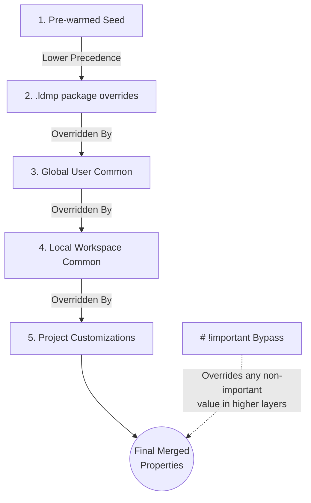
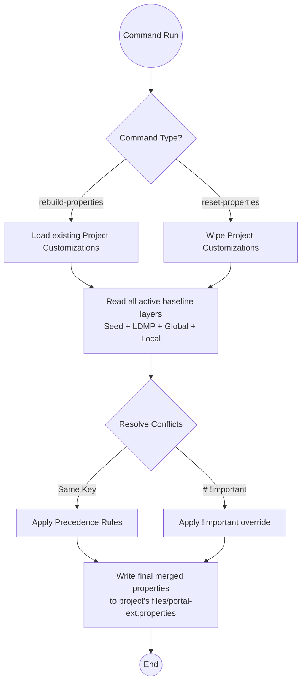

# LDM Properties Cascade & Override Hierarchy

This document outlines the **5-Layer Properties Cascade** and CSS-style `# !important` override mechanism  used by Liferay Docker Manager (LDM) to manage `portal-ext.properties` files.

---

## 1. Precedence Levels (Lowest to Highest)

When LDM synchronizes or rebuilds project properties, it merges settings from five distinct layers. A higher-precedence layer will override values defined in lower-precedence layers.

| Layer | Source | Location | Purpose |
| :---: | :--- | :--- | :--- |
| **1** | **Pre-warmed Seed** | Built-in resource baseline | Baseline properties for standard Liferay Docker configuration. |
| **2** | **`.ldmp` package overrides** | `[project]/.liferay-docker/ldmp-portal-ext.properties` | Properties imported from a snapshot or snapshot package restore. |
| **3** | **Global User Common** | `~/.ldm/common/portal-ext.properties` | Machine-wide developer overrides. |
| **4** | **Local Workspace Common** | `[workspace]/common/portal-ext.properties` | Project-group/workspace developer defaults shared across projects. |
| **5** | **Project Customizations** | `[project]/files/portal-ext.properties` | Manual project-level settings (retains user edits). |



---

## 2. Precedence Overrides with `# !important`

To allow low-precedence layers to lock down or enforce values (e.g. global user/workspace rules that projects should not override), LDM supports CSS-style `!important` markers.

### How it works

1. A property can be annotated as `!important` in any properties layer.

2. An important property will override normal (non-important) definitions from **any** layer, regardless of precedence.

3. If multiple layers mark the same property as `!important`, the conflict is resolved by the highest layer in the 5-layer precedence hierarchy.

### Syntax and Formatting

To ensure total compatibility with standard properties files, the `!important` rule must be written inside a comment so standard properties parsers (e.g. Liferay's portal properties loader) do not throw syntax errors.

#### A. Preceding Line Comment (Recommended)

Add `# !important` on the line immediately preceding the property:

```properties
# !important
default.admin.password=test
```

#### B. Inline Comment

Add `# !important` as an inline comment at the end of the property definition line:

```properties
default.admin.password=test # !important
```

---

## 3. CLI Management Commands

LDM exposes CLI commands under the `config` namespace to manage the properties hierarchy:



### Rebuild Properties 

```bash
ldm config rebuild-properties [project] [--dry-run]
```

Reconstructs and synchronizes properties from all active layers, while fully preserving manual edits in your Project Customizations layer.

### Reset Properties 

```bash
ldm config reset-properties [project] [--dry-run]
```

Wipes out all Project-level customizations and rebuilds properties cleanly from the remaining baseline layers (Seed + LDMP + Global Common + Local Common).

### Revert Properties 

```bash
ldm config revert-properties [project]
```

Restores the project's `portal-ext.properties` using the backup saved at creation/import time (`original-portal-ext.properties`).

---

## 4. Visual Diagnostics Inspector 

The Visual Diagnostics Web Dashboard (`ldm dashboard`) includes a **Properties Inspector** drawer. For every property in the project's config, it displays:

- **Active Value**: The final merged value.
- **Winning Origin**: The layer name that supplied the active value, color-coded for quick visual scan.
- **Cascade History**: Every layer that defined the property, the values they specified, and whether they marked it `!important`.

### Color-Coding Key

- **Seed**: Slate
- **LDMP**: Purple
- **Global Common**: Orange
- **Local Common**: Cyan
- **Project Customization**: Emerald
- **System/Runtime Injection**: Indigo (e.g., fast-login, feature flags, captcha config)

<!-- markdownlint-disable MD049 -->
---
*Last Updated: 2026-07-10* | *Last Reviewed: 2026-07-10*
