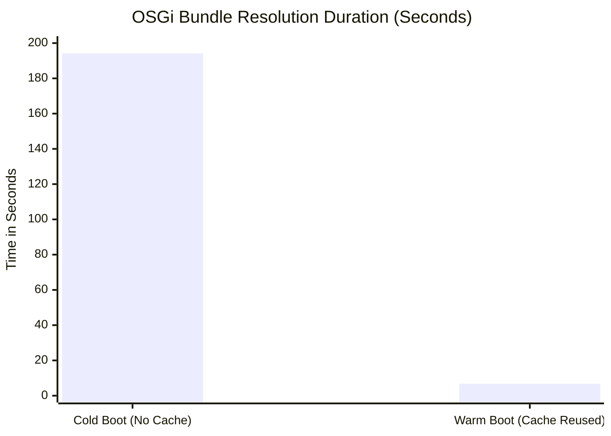

# ⚡ OSGi State Persistence Performance Showcase

Liferay startup times on local developer workstations are heavily dominated by the OSGi bundle resolution phase. By leveraging a **Hybrid Volume Strategy** that maps `/opt/liferay/osgi/state` to the host machine rather than discarding it with anonymous Docker volumes, LDM dramatically accelerates subsequent startups.

Here is the empirical evidence collected during automated E2E performance timing checks on **Apple Silicon (macOS Sequoia)** running a standard Liferay DXP instance:

---

## 📊 Timing Comparison

| Metric | Cold Boot (Cache Empty) | Warm Boot (Cache Reused) | Time Saved | Speed Improvement |
| :--- | :---: | :---: | :---: | :---: |
| **OSGi Bundle Resolution** | 194.17s | 6.71s | **187.46s** | **96.5% Faster** |



---

## 💡 Key Architectural Details

1. **Hybrid Volume Strategy**:
   - POSIX file-locking directories (like `/opt/liferay/data` and `/opt/liferay/osgi/state`) are host-mapped to enable persistence.
   - Non-lock-sensitive developer hot-reload folders (like `/mnt/liferay/deploy`, `/opt/liferay/osgi/modules`) use standard host bind-mounts.
2. **Version-Safe Cache Invalidation**:
   - LDM maintains an `.ldm_tag` marker containing the active Liferay tag.
   - If the Liferay version tag changes (e.g., during upgrades), LDM automatically invalidates the cache and wipes the directory to prevent bundle conflicts before restarting.

---

## 📈 Business Value & ROI Heuristics

For a typical Liferay development team:

- **Saved Developer Time**: A developer restarting Liferay 10 times a day saves **~31 minutes daily** (over **2.5 hours per week** of idle wait time).
- **Reduced VM CPU/Memory Thrashing**: Eliminating continuous JAR decompression and bundle scanning cycles significantly reduces host resource strain, preventing macOS hypervisor lag.
- **Higher Confidence E2E Testing**: Enables rapid, clean test cycles by removing the boot-up penalty during script validation.

---

## 🛠️ How it was Verified

The timings were gathered using the automated E2E timing script:

```bash
./scripts/verify_osgi_persistence.sh
```

This script automates setting up the mock project, starting the container in the background, timing the boot phases via log matching, clearing the container logs with a `down` lifecycle command, and comparing warm startup times.

<!-- markdownlint-disable MD049 -->
---
*Last Updated: 2026-07-13* | *Last Reviewed: 2026-07-02*
